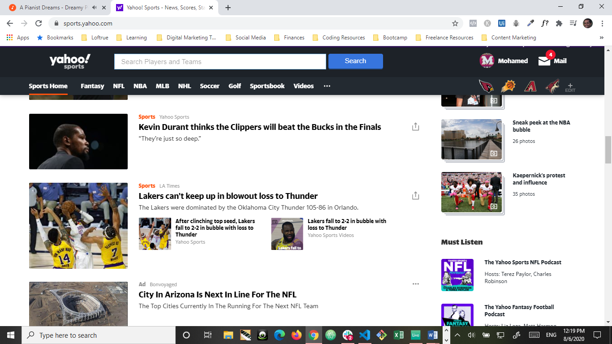

# Spoiler Alert

___
# Table of Contents

### [Description](#description)

### [Instructions](#instructions)

### [Usage](#usage)

### [Contribution](#contribution)

### [Test](#contribution)

### [License](#license)

### [Questions](#questions)
___

 ## Description

>Have you ever needed to check social media really quickly but were worried that doing so will show posts that spoil something you wanted to watch later? This app is a browser that aims to prevent spoilers of your favorite TV shows, movies, and sports by hiding any content that appears which is related to what you would like to watch later. The app will list the keywords that caused the post to be hidden without revealing its contents. You can manually unhide the content by pressing unhide.
___

___

 ## Instructions

>You go to the website, press the download link, follow instructions, and that's it. Be sure to enable the extension from you browser.

## Usage

>Be sure to launch the app before going to your social media websites. Select the categories you’d like to block the spoiler from. Then narrow your search by selecting the date and name of your specific show/movie/team from the dropdown menu. Then refine your selection by adding as many relevant specific keywords.

## Contribution

>I collaborated with Friend One, with GitHub name friendonedev and website friendonedotcom, Friend Two, GitHub name friendtwodev and website friendtwodotcom. We used API’s from NBA, NFL, MLB, NHL, MLS, UFC, OMDB, Netflix, and Hulu.

## Test

> Pick a topic that you receive content on but no spoilers. Run the app. Notice the results. The app will give you feedback.  Be sure to leave your own feedback when prompted because this will help the app learn and improve.

## License
>This project is covered under the Apache license.
  
## Questions
>My GitHub name is mohamedsalihdev.
If you have any questions you may reach
me at mohamed.salih.dev@gmail.com .

 
 
 
 
 
 
 
 
 
 
 
 
 
 
 
 
 
 
 
 
    